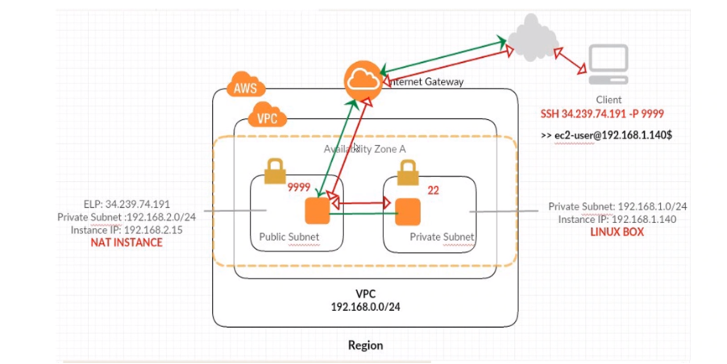

# 2 Tier infrastructue setup through AWS
- a 2-tier infrastructure can be setup via AWS by creating a virtual private cloud (VPC), with corresponding subnets, security groups and network access lists (ACLs)
- also required is an internet gateway and routing tables - one public and one private
- each component has a different role within the infrastructure:
- VPC: 
- Subnet:
- Security Group:
- Network ACL:

## Steps to set up

